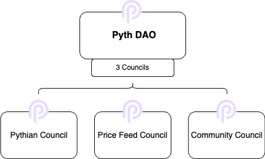

# Pyth DAO Constitution

## Terminology

- **Votable Token:** PYTH tokens staked in the staking contract at the following address: `pytS9TjG1qyAZypk7n8rw8gfW9sUaqqYyMhJQ4E7JCQ`
- **PIP:** Pyth Improvement Proposal
- **Pyth DAO Treasury:** all tokens held in the wallets at the following addresses: `Gx4MBPb1vqZLJajZmsKLg8fGw9ErhoKsR8LeKcCKFyak` for the native SOL token and `9HKkxg5dpqjUEW1U2r76SpQCH7uvDMciytNYxrpwMVNc` for the SPL Token, that is directly governed by the Pyth DAO via on-chain voting
- **Pyth Forum:** the system adopted by the Pyth DAO to manage PIPs, organize the voting process and provide connectivity to the governance contract on the Solana Blockchain, located here: [https://forum.pyth.network/](https://forum.pyth.network/)
- **Pythian Multisig Wallet:** smart contract wallet, at the following address `6oXTdojyfDS8m5VtTaYB9xRCxpKGSvKJFndLUPV3V3wT`, signed by the elected members of the Pythian Council. The Pythian Council is described in further detail below.
- **Price Feed Multisig Wallet:** smart contract wallet, at the following address `CPUZ9njbfxjqrsx713gEk8KYatvoz1Y4hvs4a5UQKEiu` signed by the elected members of the Price Feed Council. The Price Feed Council is described in further detail below.
- **Community Multisig Wallet:** smart contract wallet, at the following address `DXf94qPHKbpx3KJ275ns4kBndaHTf4BMtC8GDUvBXM7j` signed by the elected members of the Community Council. The Community Council is described in further detail below.
- **Operations Wallets:** wallets, at the following addresses `opsLibxVY7Vz5eYMmSfX8cLFCFVYTtH6fr6MiifMpA7`, `ACzP6RC98vcBk9oTeAwcH1o5HJvtBzU59b5nqdwc7Cxy` and `Ef7AjJzDXK6Tn2gYuMvL9YdXATV29b8PwpsT1yoPokTC`, that are used by the Pythian Council, the Price Feed Council and the Community Council respectively to submit PIPs on-chain. These wallets can be used by automated processes to make proposals or by council members to propose large proposals that would otherwise require many hardware wallet signatures.
- **PGAS:** utility token native to the Pythnet Appchain, governed by the Pyth DAO
- **Pythnet Appchain:** blockchain instance dedicated to the production of the Pyth data, governed by the Pyth DAO
- **Pyth Lazer:** system dedicated to the production of the Lazer data, governed by the Pyth DAO
- **Pyth Express Relay (ER):** protocol instance that enables DeFi applications to auction off the rights to swap tokens
- **Pyth Entropy (Entropy):** protocol instance that provides applications with provably random numbers
- **Oracle Integrity Staking (OIS):** protocol that leverages PYTH tokens specifically staked for the purpose of improving the integrity of the pyth data
- **DeFi:** decentralized finance applications running on blockchain

## Introduction

This Constitution describes the decision-making framework for the Pyth DAO and the governing framework for the holders of $PYTH.

Rules and procedures in this Constitution will be generally enforced through on-chain contracts and the associated parameters, unless specified by the Pyth DAO for actuation off-chain.

The Pyth DAO LLC, is legally structured as “a non-profit DAO LLC formed under the laws of the Republic of Marshall Islands, formed to serve the Pyth DAO LLC” (of which the OPERATING AGREEMENT OF PYTH DAO LLC is available at: [ipfs://QmP2GmL1n2WbHd7AtHqyXVWFyyHH36aZLfVZbNoqhommJi](https://ipfs.io/ipfs/QmP2GmL1n2WbHd7AtHqyXVWFyyHH36aZLfVZbNoqhommJi)). The Pyth DAO LLC is algorithmically managed, such that actions taken by the Pyth DAO via the governance contract on the Solana Blockchain are deemed to be actions of the Pyth DAO LLC. The legal entity enables the Pyth DAO LLC to hold the treasury and pay Pyth DAO related costs and expenses, protect Pyth DAO members from unlimited liability, and allow Pyth DAO members to take part in governance by providing a clear framework in respect of the rights and duties of Pyth tokenholders that hold Votable Tokens.

## Pyth DAO Governance Procedures

### Pyth Improvement Proposals

PIPs are the primary methods to introduce, discuss and implement changes to the Pyth DAO Constitution, governance and operations.

### PIP Types

Each PIP must be labeled as Constitutional PIPs or Operational PIPs as described in more detail below:

- Constitutional PIPs are voted on by the Pyth DAO and they involve:
  - the upgrade of the Governance, Staking or Multisig programs
  - the amendment of this Constitution
  - the creation of Pyth DAO councils and sub-committees
- Operational PIPs that are either voted on by the Pyth DAO or delegated to one of the three Councils.
  - Operational PIPs that are voted on by the Pyth DAO:
        - the election of members of the Pythian Council
        - the election of members of the Price Feed Council
        - the election of members of the Community Council
        - the management of the Pyth DAO Treasury
        - the exceptional removal and replacement of a council member
  - Operational PIPs delegated to the Pythian Council involve:
        - the upgrade of the oracle program
        - the upgrade of the verification program for each of the blockchains where Pyth data or Lazer data are accessible
        - the setting of data request fees per blockchain, as well as other protocol or network fees
        - the management of PGAS allocation and delegation to validators
        - the upgrade of the ER program for each of the blockchains where ER is available
        - the assignment of the relayer function for ER and monitoring of the performance of such assignment
        - the setting of the ER fee distribution
        - the upgrade of the Entropy program for each of the blockchains where Entropy is available
        - the setting of Entropy request fees for each of the blockchains where Entropy is available
        - the setting of pool capacity parameters in OIS
        - the setting of delegation fee for stake delegators in OIS
        - the determination of slashing amounts from the amount staked in OIS in compliance with the slashing rules and procedures defined by the DAO in [https://docs.pyth.network/home/oracle-integrity-staking/slashing-rulebook](https://docs.pyth.network/home/oracle-integrity-staking/slashing-rulebook)
  - Operational PIPs delegated to the Price Feed Council involve:
        - the management of the list of price feeds available through Pyth
        - the selection of publishers and the setting of the minimum number of such publishers per price feed
  - Operational PIPs delegated to the Community Council:
        - the management of community platforms, initiatives, campaigns and programs with the aim to foster, develop and grow community engagement and expand the community's reach
        - the administration of the community budget assigned by the DAO to enable activities of the community

### PIP Process

No PIP may be in violation of any of terms of the Operating Agreement of Pyth DAO LLC, or any applicable laws (including, in particular, sanctions-related regulations).

The end-to-end process length is 7 days.

1. **Proposal Submission**

A PIP is submitted through a structured process via the **Pyth Forum** (e.g. GitHub), marking the initiation of the formal review process. Each PIP needs to include:

- Abstract - that summarizes the PIP
- Rationale - that explains why the Pyth community should implement the PIP and how it aligns with community’s mission and values
- Key Terms - technical and/or commercial associated with the PIP
- Implementation Plan - steps envisioned to implement the PIP, including resources needed for each step and timelines. The implementation plan may include binding on-chain actions that will automatically execute when the PIP passes.

The requirements for formally advancing a proposal to the on-chain governance program are:
- For a proposal voted on by the Pyth DAO, the proposer needs to hold at least 0.25% of the current Votable Tokens.
- For a proposal voted on by a council, a member of such council needs to propose it.

2. **DAO Voting on formal PIP (7 days)**

The Pyth DAO is able to vote directly on-chain on the submitted PIP for 7 days. The PIP passes if the following condition is met:

- in the case of a Constitutional PIP, > 67% of all Votable Tokens have been cast "in favor"; or
- in the case of an Operational PIP that is voted on by the Pyth DAO, > 50% of all Votable Tokens have been cast "in favor"

3. **Implementation**

The PIP is then fully executed and implemented. Any on-chain actions in the implementation plan will execute automatically in this step. The Pyth DAO LLC, council members and other service providers of the Pyth DAO LLC will take any necessary off-chain actions to implement PIPs which have passed.

## Council Election Process & Voting Procedures

1. **The Pythian Council**

The Pythian Council is made of 8 members who are signers of the Pythian Multisig Wallet.  The Pythian Multisig Wallet has powers to perform actions that are delegated to it by the Pyth DAO. The composition of the Pythian Council should be geographically diverse in furtherance of the ethos, mission and guiding values of the Pyth DAO. The execution of such actions by the Pythian Council requires 7-of-9 approval (with one of the default multisig holders being the Operations Wallet itself). The on-chain submission of a PIP using the Operations Wallet carries one vote in favour of the PIP.

The first election of the Pythian Council will be conducted via on-chain voting. The date chosen for the first election will form the basis for all future elections. Every election should begin 6 months after the previous election has started and it will replace 4 members of its cohort of 8 members.

The 4 members to remain are selected given the following cascading criteria (the Election Criteria):

- the shorter tenure till the date of the election;
- in the case of equal tenure, the member with the higher amount of votes in the last election;
- in the case of equal tenure and equal amounts of votes, the member with the higher count of multisig participations

unless such member decides to step down from the Pythian Council.

Any Council member who has voted less than 1/3 of the proposals during the term will be excluded from re-election.

The following process governs the election that starts at time T:

- Nomination (T until T+2 days): Any Pyth DAO LLC member can be nominated or nominate himself or herself for candidacy to the Council. Each person nominating a candidate or the candidate himself or herself, must hold at least 0.5 basis points of the current Votable Tokens
- Member Election (T+2 days until T+7 days): Each Votable Token may be cast for one candidate.

In the event of a member needing to be exceptionally replaced outside of scheduled elections, the non-elected candidate with the highest amount of votes from the last election of the Pythian Council will be offered membership in the Pythian Council, subject to the Election Criteria as set forth above.

2. **The Price Feed Council**

The Price Feed Council is made of 7 members who are signers of the Price Feed Multisig Wallet. The Price Feed Multisig Wallet has powers to perform actions that are delegated to it by the Pyth DAO. The execution of such actions by the Price Feed Council requires 5-of-8 approval (with one of the default multisig holders being the Operations Wallet itself). The on-chain submission of a PIP using the Operations Wallet carries one vote in favour of the PIP.

The first election of the Price Feed Council will be conducted via on-chain voting. The date chosen for the first election will form the basis for all future elections. Every election should begin 6 months after the previous election has started and it will replace 3 members of its cohort of 7 members.

The 4 members to remain are selected given the following cascading criteria:

- the shorter tenure till the date of the election;
- in the case of equal tenure, the member with the higher amount of votes in the last election;
- in the case of equal tenure and equal amounts of votes, the member with the higher count of multisig participations

unless such member decides to step down from the Pythian Council.

Any Council member who has voted less than 1/3 of the proposals during the term will be excluded from re-election.

The following process governs the election that starts at time T:

- Nomination (T until T+2 days): Any DAO member can be nominated or nominate himself or herself for candidacy to the Council. Each candidate sponsor, a person nominating a candidate or the candidate himself or herself, must hold at least 0.5 basis points of the current Votable Tokens
- Member Election (T+2 days until T+7 days): Each token may be cast for one candidate.

In the event of a member needing to be exceptionally replaced outside of scheduled elections, the non-elected candidate with the highest amount of votes from the last election of the Price Feed Council will be offered membership in the Price Feed Council.

3. **The Community Council**

The Community Council is made of 7 members who are signers of the Community Multisig Wallet. The Community Multisig Wallet has powers to perform actions that are delegated to it by the Pyth DAO. The execution of such actions by the Community Council requires 6-of-8 approval (with one of the default multisig holders being the Operations Wallet itself). The members of the Community Council must adhere to all elements of the "Code of Conduct for the Community Council" available at: [pyth-dao-code-of-conduct-for-the-community-council-v1.2.pdf](https://ipfs.io/ipfs/bafybeicijbpwxw553ax4kxmal6b7zg3qboclvw4omw5jhf7u3jagv3pxlu/pyth-dao-code-of-conduct-for-the-community-council-v1.2.pdf)

The first election of the Community Council will be conducted via on-chain voting. The date chosen for the first election will form the basis for all future elections. Every election should begin 12 months after the previous election has started and it will replace 2 members of its cohort of 7 members.

The 5 members to remain are selected given the following cascading criteria:

- the shorter tenure till the date of the election;
- in the case of equal tenure, the member with the higher amount of votes in the last election;
- in the case of equal tenure and equal amounts of votes, the member with the higher count of multisig participations

unless such member decides to step down from the Pythian Council.

Any Council member who has voted less than 1/3 of the proposals during the term will be excluded from re-election.

The following process governs the election that starts at time T:

- Nomination (T until T+2 days): Any DAO member can be nominated or nominate himself or herself for candidacy to the Council. Each candidate sponsor, a person nominating a candidate or the candidate himself or herself, must hold at least 0.5 basis points of the current Votable Tokens
- Member Election (T+2 days until T+7 days): Each token may be cast for one candidate.

In the event of a member needing to be exceptionally replaced outside of scheduled elections, the non-elected candidate with the highest amount of votes from the last election of the Price Feed Council will be offered membership in the Price Feed Council.

## Community Values

The Pyth DAO is built on the principles of radical ownership and governance. Its members work together to achieve common goals, and they share in working towards the success of Pyth. As such, the guiding values of the Pyth DAO should be:

- Sustainability: the Pyth DAO should be long-term hungry;
- Inclusivity: everyone can play a role in the Pyth DAO; and
- Enablement-focused: individuals and teams that innovate, compete and contribute to the growth of Pyth should be empowered and encouraged.
